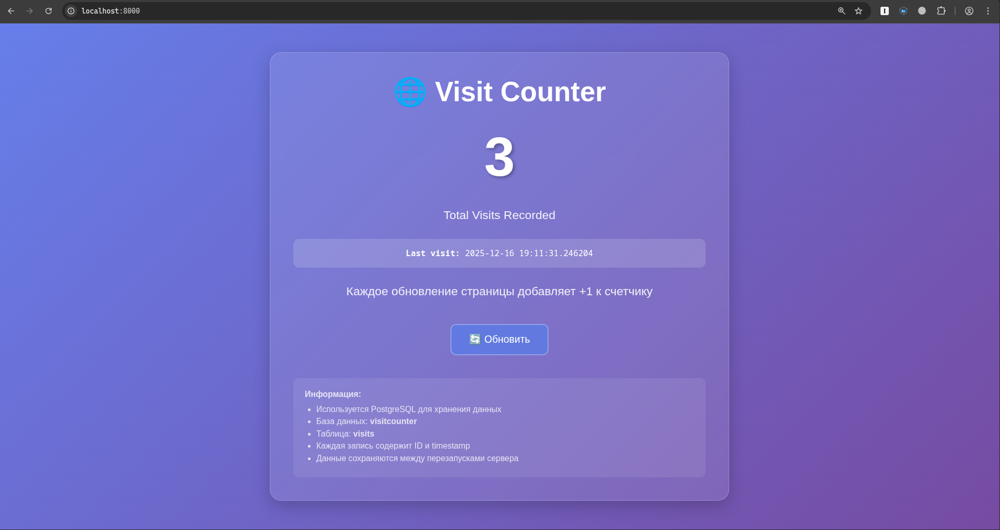

# Visit Counter Web Application


## Functionality 

- With every GET-request, a new timestamp is added to the database
- Displays the total number of visits
- Uses PostgreSQL for data storage
- Data persists between restarts

## Stack

- Python Flask application
- PostgreSQL database
- Docker
- Docker Compose

## Quick Start

```bash
git clone https://github.com/L0puh/visitcounter_container 
cd visitcounter_container
docker-compose up -d
```
check `http://localhost:8000` in the browser or 
`curl http://localhost:8000` in the terminal
